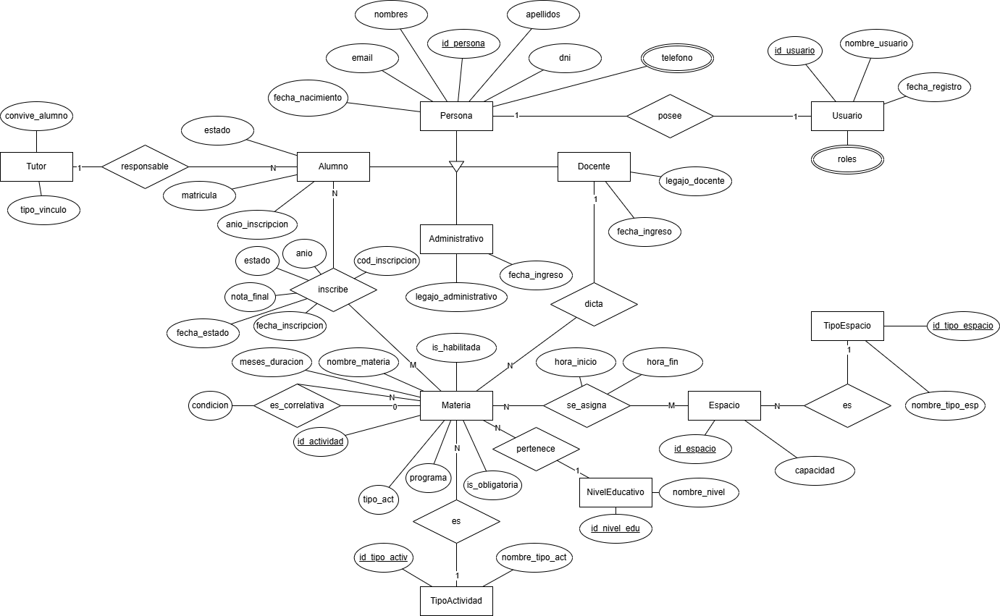

# Nombre del Proyecto

<p align="center">
  
</p>

<p align="center">
  <i>Modelo Entidad Relación (MER)</i>
</p>

---

# Configuración del Proyecto

## 1. Clonar el Repositorio

```bash
git clone <url-del-repositorio>
cd <directorio-del-proyecto>
```

---

## 2. Configurar Variables de Entorno

Antes de ejecutar la aplicación, configurá las siguientes variables de entorno:

### Base de Datos

| Variable | Descripción | Ejemplo |
|---|---|---|
| `DB_URL` | URL de conexión JDBC | `jdbc:postgresql://localhost:5432/midb` |
| `DB_USERNAME` | Usuario de la base de datos | `postgres` |
| `DB_PASSWORD` | Contraseña de la base de datos | `secreto` |

### JWT

| Variable | Descripción | Ejemplo |
|---|---|---|
| `JWT_SECRET_KEY` | Clave secreta en Base64 (mínimo 256 bits) | `TmMsHG...` |
| `JWT_TIME_EXPIRATION` | Expiración del token en milisegundos | `86400000` (24hs) |

### Generar una clave secreta segura para JWT

```bash
openssl rand -base64 32
```

---

## 3. Configurar la Aplicación

Actualizá el archivo `src/main/resources/application.properties`:

```properties
# Base de datos
spring.datasource.url=${DB_URL}
spring.datasource.username=${DB_USERNAME}
spring.datasource.password=${DB_PASSWORD}

spring.jpa.hibernate.ddl-auto=update
spring.jpa.properties.hibernate.dialect=org.hibernate.dialect.PostgreSQLDialect

# JWT
jwt.secret.key=${JWT_SECRET_KEY}
jwt.time.expiration=${JWT_TIME_EXPIRATION}
```

---

## 4. Instalar Dependencias

```bash
mvn clean install
```

---

## 5. Ejecutar la Aplicación

```bash
mvn spring-boot:run
```

También podés ejecutar el método main de la clase `ApiTfiApplication` directamente desde el IDE.

---

# Endpoints de la API

## URL Base

```text
http://localhost:8080
```

---

## Autenticación

### Login

**Endpoint**

```http
POST /auth/login
```

**Body**

```json
{
  "email": "ejemplo@ejemplo.com",
  "password": "contraseña123"
}
```

**Respuesta**

```json
{
  "token": "eyJhbGciOiJIUzI1NiJ9..."
}
```

---

### Requests Autenticados

Incluí el token en el header `Authorization` para todos los endpoints protegidos:

```http
Authorization: Bearer <token>
```

---

## Endpoints de Usuario

### Crear Usuario

**Endpoint**

```http
POST /users
```

**Body**

```json
{
  "email": "ejemplo@ejemplo.com",
  "firstName": "Juan",
  "lastName": "Pérez",
  "password": "contraseña123",
  "roles": ["ADMIN"]
}
```

---

### Obtener Usuario por ID

**Endpoint**

```http
GET /users/{userId}
```

**Headers**

```http
Authorization: Bearer <token>
```

---

# Tests

```bash
mvn test
```

---

# Despliegue

## Empaquetar la Aplicación

```bash
mvn clean package
```

## Ejecutar el JAR Generado

```bash
java -jar target/<nombre-del-proyecto>.jar
```

---

# Notas Adicionales

- Nunca commitees `application.properties` con credenciales reales — usá variables de entorno.
- Agregá `application.properties` al `.gitignore` si contiene datos sensibles, y proporcioná un `application.properties.example` como referencia.
- La clave secreta JWT debe tener al menos 256 bits (32 bytes) al decodificarse desde Base64.
- La expiración del token es en milisegundos: `86400000` = 24 horas, `3600000` = 1 hora.
- Para entornos de producción usá un gestor de secretos (AWS Secrets Manager, HashiCorp Vault) en lugar de variables de entorno del sistema.